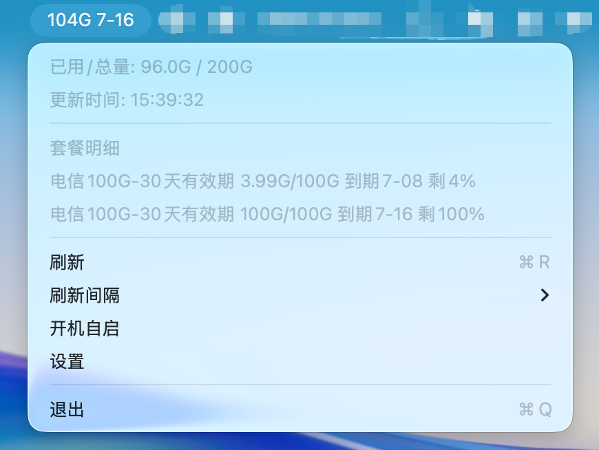

# SIM流量菜单栏工具

一个Mac菜单栏小工具，用于查看物联网SIM卡套餐余量和到期时间。

> 适用范围：本App仅适用于“南京阿波罗”公司的“设备套餐管理”公众号中的余量查询。

## 适用公众号


## App效果



## 功能

- 菜单栏显示总剩余流量和最远到期日。
- 下拉菜单显示已用/总量、更新时间和套餐明细。
- 支持按手机号加载绑定卡片，并保存选中的ICCID。
- 支持保存已加载卡片，并在菜单里快速切换卡片。
- 支持低余量和临近到期提醒：低于`10G`或最远到期小于`3天`时，菜单栏会显示警告符号并发送系统通知。
- 支持菜单内设置刷新间隔。
- 支持用户级开机自启。
- 支持手动重置配置，清除本地手机号、ICCID、已加载卡片和开机自启设置。
- 更新时间以相对时间显示，例如`刚刚`、`2分钟前`。
- 对网络异常、未查到卡片、未查到套餐和服务返回格式变化提供更明确的提示。

## 隐私说明

手机号和ICCID只保存在本机配置文件中，不会上传到本项目以外的服务。请不要把自己的配置文件、截图中的完整手机号或完整ICCID提交到公开仓库。

## 运行

```bash
swift run SimQuotaMenu
```

首次运行后，点击菜单栏里的`设置`或菜单中的`设置`：

1. 输入手机号。
2. 点击`加载卡片`。
3. 从下拉列表选择卡片，选择后会自动保存并关闭设置窗口。

刷新间隔和开机自启在菜单里设置：

- `开机自启`：点击切换，打勾表示已启用。
- `刷新间隔`：二级菜单固定提供`1/5/10/30/60/120分钟`。
- `切换卡片`：使用设置中已加载过的卡片列表快速切换。
- `重置配置`：清除本地手机号、ICCID、已加载卡片和开机自启设置。

菜单栏标题采用轻量格式：

```text
104G 7-16
```

其中流量是所有可用套餐的剩余量合计，日期是仍有余量的套餐中最远到期日。下拉菜单会显示已用/总量、更新时间，以及最多5条套餐明细，格式类似：

当总剩余流量低于`10G`，或最远到期日距离当前时间小于`3天`时，标题会显示为：

```text
⚠ 8.5G 6-20
```

同时会尝试发送系统通知。首次触发时macOS可能会询问通知权限。

```text
电信100G-30天有效期 4.22G/100G 到期07-08 剩4%
```

配置文件保存在：

```text
~/Library/Application Support/SimQuotaMenu/config.json
```

开机自启使用用户级LaunchAgent，配置在：

```text
~/Library/LaunchAgents/local.sim-quota.menu.plist
```

## 打包成.app

```bash
chmod +x scripts/package_app.sh
scripts/package_app.sh
open dist/SimQuotaMenu.app
```

打包产物在：

```text
dist/SimQuotaMenu.app
```

打包脚本会使用ad-hoc签名：

```bash
codesign --force --deep --sign - dist/SimQuotaMenu.app
```

这不等同于Apple公证，首次打开下载版App时仍可能看到macOS安全提示。

## 未公证App的打开方式

本项目没有使用付费AppleDeveloperID证书签名/公证。下载DMG后如果macOS提示无法打开，可以选择以下方式之一：

- 在Finder里右键App，选择`打开`，再确认打开。
- 如果你确认来源可信，也可以移除下载隔离标记：

```bash
xattr -dr com.apple.quarantine /Applications/SimQuotaMenu.app
```

## 打包成.dmg

```bash
chmod +x scripts/package_dmg.sh
scripts/package_dmg.sh
```

打包产物在：

```text
dist/SimQuotaMenu-版本号.dmg
```

## 开发

```bash
swift build
swift run SimQuotaMenu
```

本项目没有第三方依赖。打包产物和SwiftPM构建目录已在`.gitignore`中排除。

版本号统一维护在[VERSION](VERSION)。打包脚本默认读取该文件，也可以显式传入版本号覆盖：

```bash
scripts/package_dmg.sh 0.2.0
```

## 许可证

MIT License
